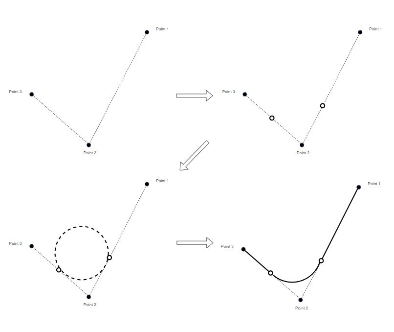

# Opendrive Track generator 
### Converts a list of (x,y) coordinates into a track built with arcs and lines. 

**For the version using classes, objects and OOP elements, see the oop-rewrite branch**

Input format: JSON file containing a list `data` of (x,y) coordinates such that for any `i`, 0 <= i < len(list), `data[i]` and `data[i+1]` are going to be connected by this program. 

Run `python3 main.py` to generate the output from "input1.json".

Output format: Opendrive .xodr file

#### How it works 
Given any 3 points connected in series, the program will smooth out the turn in the middle point by placing an arc. The arc will start and end at equidistant locations from the middle point, along the reference lines drawn out by the points. A reference line is a line drawn out by connecting the points, eg connecting  `data[i]` and `data[i+1]`. The distance from the middle point and the arc start and end points is 1/2 the length of the shorter reference line connected to the middle point. Any arcs that are not connected together are connected with straight lines. 

#### Generation of arc:

### Current problems

- The track currently has a set width of 4 metres. If the coordinates given are too small, it may cause
the track to overlap on itself weirdly.

- If the coordinates are sequenced in a way where reference lines drawn will intersect, then it will cause the track to overlap without making a proper intersection.
